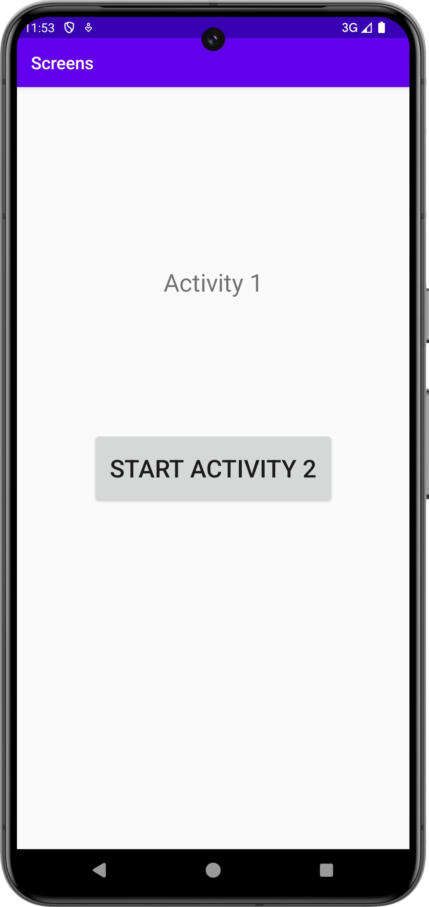
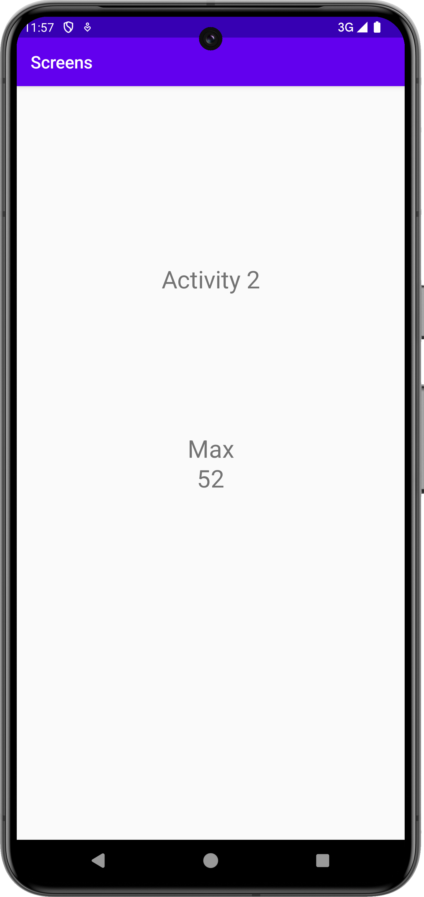

# Rapport

**Skriv din rapport här!**

_Du kan ta bort all text som finns sedan tidigare_.

## Följande grundsyn gäller dugga-svar:

- Ett kortfattat svar är att föredra. Svar som är längre än en sida text (skärmdumpar och programkod exkluderat) är onödigt långt.
- Svaret skall ha minst en snutt programkod.
- Svaret skall inkludera en kort övergripande förklarande text som redogör för vad respektive snutt programkod gör eller som svarar på annan teorifråga.
- Svaret skall ha minst en skärmdump. Skärmdumpar skall illustrera exekvering av relevant programkod. Eventuell text i skärmdumpar måste vara läsbar.
- I de fall detta efterfrågas, dela upp delar av ditt svar i för- och nackdelar. Dina för- respektive nackdelar skall vara i form av punktlistor med kortare stycken (3-4 meningar).

Programkod ska se ut som exemplet nedan. Koden måste vara korrekt indenterad då den blir lättare att läsa vilket gör det lättare att hitta syntaktiska fel.


För att lösa denna uppgift har först En ny akvititet skapats genom File > Activity > Empty Activity,
denna döptes till MyActivity.

Sedan har Text och knapp lagts till i MainActivity.
Knappen har fått sin funktionalitet i "MainActivity.java" genom koden:
```
Button button=findViewById(R.id.startActivity2);

button.setOnClickListener(new View.OnClickListener(){
    OnClick(){
        Intent
        Extras
        StartActivity
}
```

Intent och Extras säger åt knappen vad den ska göra, Intent startar MyActivity
och Extras skickar med tillhörande data som man kan välja att ha med själv.
jag valde 2 strings som har med mitt namn och ett nummer.
Denna kod hämtar extras till MyActivity.

```
String name = extras.getString("Name");
String number = extras.getString("Number");

TextView nameText=findViewById(R.id.name);
nameText.setText(name);

TextView numberText=findViewById(R.id.number);
numberText.setText(number);
```

Sist har TextViews lagts till i MyActivity, den första har satt text,
de andra 2 använder Extras variabler för att få sin text.


```
function errorCallback(error) {
    switch(error.code) {
        case error.PERMISSION_DENIED:
            // Geolocation API stöds inte, gör något
            break;
        case error.POSITION_UNAVAILABLE:
            // Misslyckat positionsanrop, gör något
            break;
        case error.UNKNOWN_ERROR:
            // Okänt fel, gör något
            break;
    }
}
```

Bilder läggs i samma mapp som markdown-filen.




Läs gärna:

- Boulos, M.N.K., Warren, J., Gong, J. & Yue, P. (2010) Web GIS in practice VIII: HTML5 and the canvas element for interactive online mapping. International journal of health geographics 9, 14. Shin, Y. &
- Wunsche, B.C. (2013) A smartphone-based golf simulation exercise game for supporting arthritis patients. 2013 28th International Conference of Image and Vision Computing New Zealand (IVCNZ), IEEE, pp. 459–464.
- Wohlin, C., Runeson, P., Höst, M., Ohlsson, M.C., Regnell, B., Wesslén, A. (2012) Experimentation in Software Engineering, Berlin, Heidelberg: Springer Berlin Heidelberg.
